<h1 align="center">GrabMart (Singapore) Inventory Management Data Warehouse Design</h1>

<h5>Name：LI YOUBAO</h5>

Master of Science Artificial Intelligence, London Metropolitan University

---

## 1.Introduction

**Business Background**：Grab is Southeast Asia's leading super app. Its GrabMart business provides grocery and daily necessities delivery to Singaporean users through partnerships with retailers and Dark Stores. Currently, Grab faces challenges in integrating the massive amounts of transaction data generated by its various independent systems (logistics, merchant management, payments, etc.), making it difficult for management to conduct unified decision analysis.

**Core issues and objectives**：Due to fluctuating demand, GrabMart faces the challenge of both stockouts of popular items and stockpiles of slow-moving goods. Business analysts recommended designing and implementing a data warehouse solution, focusing on inventory management processes, to improve inventory accuracy and transparency, thereby optimizing operating costs and enhancing customer satisfaction.

**Core issues and objectives**：
Inventory management involves three key stages:

* **Purchase Ordering:** When inventory falls below a threshold, place an order with the supplier, recording the order quantity, date, product, and supplier information.
* **Receiving and Warehousing:** Receive goods from the supplier and update the received quantity and inventory records.
* **Inventory Control:** Maintain accurate inventory levels at each location, including new product arrivals, existing inventory updates, and location tracking.

**Data analysis needs**：
Management needs to leverage the data warehouse to achieve the following analytical capabilities:

* **Inventory Monitoring:** View daily product inventory levels and weekly reports on reaching minimum inventory thresholds.

* **Multi-dimensional Analysis:** Analyze inventory status by brand, category, supplier, and other dimensions.

* **Purchase Fulfillment Analysis:** Generate reports on the sending and receiving of purchase orders over the past four weeks, and evaluate receipt status monthly or by supplier.

**Additional Information**：
The solution will integrate data from GrabMart's inventory and supplier management system, including supplier details, product information, inventory levels, and inventory transfer records between suppliers and warehouses/stores.

---

## 2.The Analysis and design of a dimension data model

><font color="#968107">This section corresponds to questions 1.1-1.4 in the original problem.</font>

**1.1 Identify and define the grain (detail level) of three different central fact tables to represent
the three main business activities of the inventory management business area.(10 Marks):**

* Placing purchase orders: When product inventory levels fall below a preset minimum threshold, the system sends purchase orders to suppliers. Each order record corresponds to an order for a product from a supplier.
* Receiving Goods from Suppliers: When a supplier delivers an order, the system receives and updates the order receipt information. Each line of data records the order quantity for each item received from a supplier, as well as the actual total number of orders received.
* Inventory control and maintenance, in essence, refers to inventory levels. Each row of data records the current inventory and warning inventory for each product in each store.

**1.2 Identify dimensions of each central fact table based on the available data source that will meet the reporting and analysis requirements mentioned in the business case scenario.(10 Marks):**

***For purchase orders, the dimensions are actually product and supplier, including the quantity of products ordered, cost, order date, and a unique order number, namely:***

* PurchaseOrderId
* OrderDate
* ProductId
* SupplierId
* OrderedQuantity
* UnitCost

***For goods receipt, this includes the product and supplier, order quantity, actual quantity received, receipt date, and a unique order number. The product and supplier can be associated with the order table using the order ID, i.e.:***

* ReceiptId
* PurchaseOrderId
* OrderedQuantity
* ReceivedQuantity
* ReceivedDate

***Similarly, regarding inventory levels, the dimensions actually include both stores and products, there should also be current inventory, minimum warning inventory, and a unique primary key:***

* InventoryId
* ProductId
* LocationId
* StockLevel
* MinimumStockLevel
* LastUpdatedDate

**1.3 Identify attributes of dimensions and measures of fact tables based on the available data
source descriptions that will meet the reporting and analysis requirements mentioned in the
business case scenario. (10 Marks)**

***For purchase orders:***

|   Column Name |   Data Type   |   Key |   Null  |
|   :--------   |   :-----  |   :-----  |   :----   |
|   PurchaseOrderId |   varchar(10)   |   Primary Key   |   not   |
|   OrderDate |   date   |   -   |   not   |
|   ProductId |   varchar(10)   |   Foreign Key    |   not   |
|   SupplierId |   varchar(10)   |   Foreign Key    |   not   |
|   OrderedQuantity |   int    |   -   |   not   |
|   UnitCost |   decimal(18,2)   |   -   |   not   |

***For goods receipt:***

|   Column Name |   Data Type   |   Key |   Null  |
|   :--------   |   :-----  |   :-----  |   :----   |
|   ReceiptId |   varchar(10)   |   Primary Key   |   not   |
|   PurchaseOrderId |   varchar(10)   |   Foreign Key    |   not   |
|   OrderedQuantity |   int   |   -    |   not   |
|   ReceivedQuantity |   int    |   -   |   not   |
|   ReceivedDate |   date  |   -   |   not   |

***For inventory levels:***

|   Column Name |   Data Type   |   Key |   Null  |
|   :--------   |   :-----  |   :-----  |   :----   |
|   InventoryId |   varchar(10)   |   Primary Key   |   not   |
|   ProductId |   varchar(10)   |   Foreign Key    |   not   |
|   LocationId |   varchar(15)   |   Foreign Key    |   not   |
|   StockLevel |   int    |   -   |   not   |
|   MinimumStockLevel |   int    |   -   |   not   |
|   LastUpdatedDate |   date  |   -   |   not   |

>**Since foreign keys are mentioned here, I will also list other tables for easier understanding: Based on the description in the assignment, we can analyze that it has roughly the following attributes:**

***Products Table:***

|   Column Name |   Data Type   |   Key |   Null  |
|   :--------   |   :-----  |   :-----  |   :----   |
|   ProductId |   varchar(10)   |   Primary Key   |   not   |
|   ProductName |   varchar(15)   |   -    |   not   |
|   Brand |   varchar(15)   |   -    |   not   |
|   Category |   varchar(15)    |   -   |   not   |
|   UnitPrice |   decimal(18,2)    |   -   |   not   |

***Suppliers Table:***

|   Column Name |   Data Type   |   Key |   Null  |
|   :--------   |   :-----  |   :-----  |   :----   |
|   SupplierId |   varchar(10)   |   Primary Key   |   not   |
|   SupplierName |   varchar(15)   |   -    |   not   |
|   ContactName |   varchar(15)   |   -    |   not   |
|   Phone |   varchar(15)    |   -   |   not   |
|   Email |   varchar(50)    |   -   |   not   |
|   Address |   varchar(100)    |   -   |   not   | |

***WareHouse or store,named Locations***

|   Column Name |   Data Type   |   Key |   Null  |
|   :--------   |   :-----  |   :-----  |   :----   |
|   LocationId |   varchar(10)   |   Primary Key   |   not   |
|   LocationName |   varchar(15)   |   -    |   not   |
|   LocationType |   varchar(15)   |   -    |   not   |
|   City |   varchar(15)    |   -   |   not   |

**According to the requirements from assignment 1 also include a report and analysis, so there are also an analytical and statistical table. The report and analysis requirements are:
• Daily stock levels of all products for the last month
• Weekly reports identifying products that have reached minimum stock levels
• Daily and weekly reports of sent and received purchase orders for the last four weeks
• Analysis of received stock orders by supplier and by month**

***Data Analysis (for report and analysis):***

|   Column Name |   Data Type   |   Key |   Null  |
|   :--------   |   :-----  |   :-----  |   :----   |
|   DateId  |   int   |   Primary Key,Foreign Key   |   not   |
|   FullDate    |   date   |   -    |   not   |
|   Day  |   int   |   -    |   not   |
|   DayName  |   varchar(15)    |   -   |   not   |
|   WeekNumber   |   int   |   -    |   not   |
|   Month    |   int   |   -    |   not   |
|   MonthName   |   nvarchar(20)   |   -    |   not   |
|   Quarter    |   int   |   -    |   not   |
|   Year    |   int   |   -    |   not   |

**1.4 Use simple star schema to define the structure that shows how the fact tables are related to their dimensions. Create a graphical representation of the four simple star schemas in one page. (10 Marks):**

>**1) The Purchase Orders table is connected with the product table and the supplier table. <br>Check:**

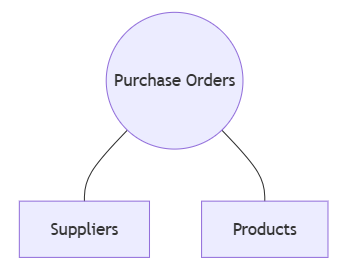

>**2) The Goods Received table is connected to the Product table and Supplier table; in fact, it can be directly joined with the Purchase Orders table to find the products and suppliers. <br>Check:**

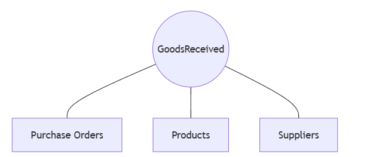

>**3) The InverntoryLevels table is connected to the Product table and Locations table. <br>Check:**

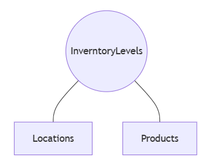

>**4) The Data Analysis table is connected to the Purchase orders and Inventory levels table and Goods Received. <br>Check:**

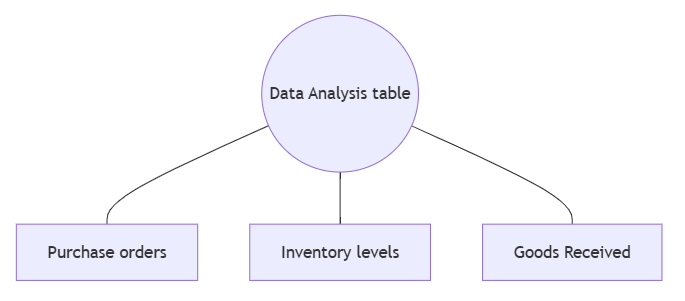

---

## 3.The implementation and testing of the data warehouse (include screen shots to show SQL commands and their results)

><font color="#968107">This section corresponds to questions 2.1-2.4, and 3.1 and 3.2 in the original problem.</font>

#### 1). 2.1 Create a database. (5 Marks)

```SQL
Create Database GrabWorkArea
```

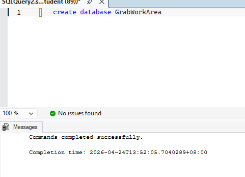

#### 2). 2.2 Create dimension tables (5 Marks)

```SQL
CREATE TABLE dbo.ProductsFinal(
 ProductId varchar(10) NOT NULL,
 ProductName  varchar(15) NOT NULL,
 Brand varchar(15) NOT NULL,
 Category  varchar(15) NOT NULL,
 UnitPrice  decimal(18,2) NOT NULL
)


CREATE TABLE dbo.Suppliers(
 SupplierId varchar(10)  NOT NULL,
 SupplierName varchar(15)   NOT NULL,
 ContactName varchar(15) NOT NULL,
 Phone varchar(15) NOT NULL,
 Email varchar(50) NOT NULL,
 Address varchar(100) NOT NULL
 )

CREATE TABLE dbo.Locations(
 LocationId  varchar(15) NOT NULL,
 LocationName varchar(15) NOT NULL,
 LocationType  varchar(15) NOT NULL,
 City  varchar(15) NOT NULL
)
```

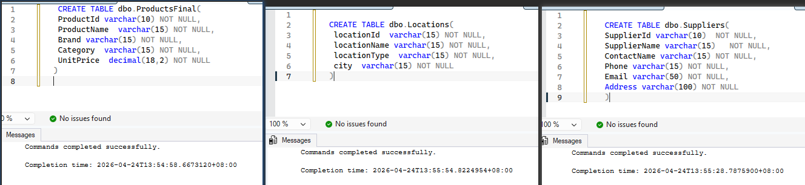

#### 3). 2.3 Create fact tables. (5 Marks)

```SQL
CREATE TABLE dbo.GoodsReceivedFinal(
 ReceiptId varchar(10) NOT NULL,
 PurchaseOrderId varchar(10) NOT NULL,
 OrderedQuantity int  NOT NULL,
 ReceivedQuantity int NOT NULL,
 ReceivedDate date NOT NULL,
) 

CREATE TABLE dbo.InverntoryLevelsFinal(
 InventoryId  varchar(10) NOT NULL,
 ProductId varchar(10) NOT NULL,
 LocationId  varchar(15) NOT NULL,
 StockLevel int NOT NULL,
 MinimumStockLevel int NOT NULL,
 LastUpdatedDate date NOT NULL,
)

CREATE TABLE dbo.PurchaseOrderFinal(
 PurchaseOrderId varchar(10)  NOT NULL,
 OrderDate  date NOT NULL,
 ProductId varchar(10) NOT NULL,
 SupplierId  varchar(10) NOT NULL,
 OrderedQuantity int NOT NULL,
 UnitCost  decimal(18,2) NOT NULL
)
```

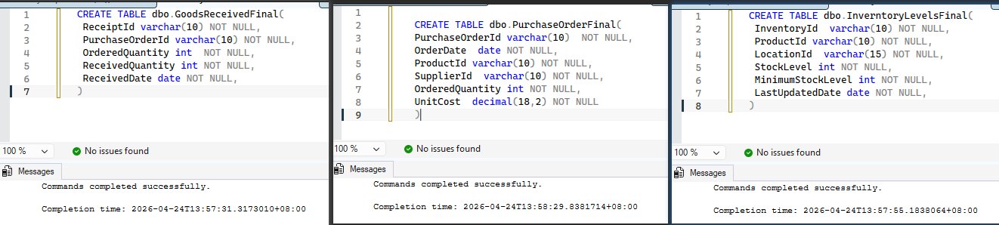

#### 4). 2.4 Add appropriate primary keys and foreign keys constraints. (5 Marks)

```SQL
ALTER TABLE dbo.ProductsFinal ADD  CONSTRAINT
 ProductId   PRIMARY KEY (ProductId);

ALTER TABLE dbo.Suppliers ADD  CONSTRAINT
 SupplierId  PRIMARY KEY (SupplierId);

ALTER TABLE dbo.Locations ADD  CONSTRAINT
 LocationId PRIMARY KEY (LocationId);
```

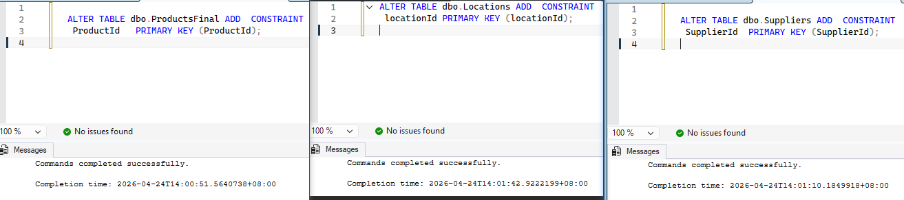

```SQL
ALTER TABLE dbo.PurchaseOrderFinal ADD  CONSTRAINT
 PurchaseOrderId PRIMARY KEY (PurchaseOrderId);
 
Alter Table dbo.PurchaseOrderFinal ADD 
CONSTRAINT FK_SupplierId FOREIGN KEY (SupplierId)
REFERENCES dbo.Suppliers (SupplierId),
CONSTRAINT FK_ProductId2 FOREIGN KEY (ProductId)
REFERENCES dbo.ProductsFinal (ProductId);
```

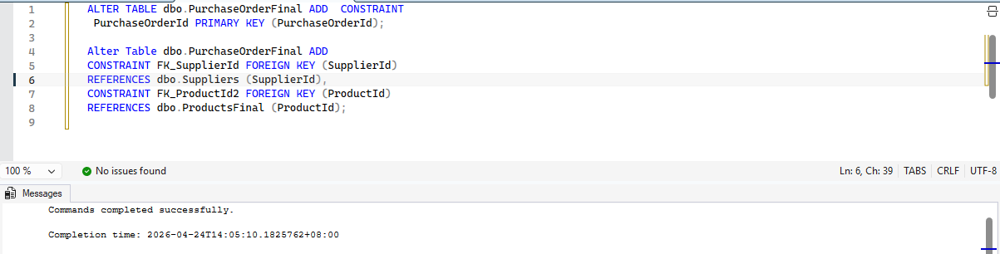

```SQL
ALTER TABLE dbo.InverntoryLevelsFinal ADD 
  CONSTRAINT PK_InventoryId PRIMARY KEY (InventoryId);
  
Alter Table dbo.InverntoryLevelsFinal ADD 
CONSTRAINT FK_LocationId FOREIGN KEY (LocationId)
REFERENCES dbo.Locations (LocationId),
CONSTRAINT FK_ProductId FOREIGN KEY (ProductId)
REFERENCES dbo.ProductsFinal (ProductId);
```

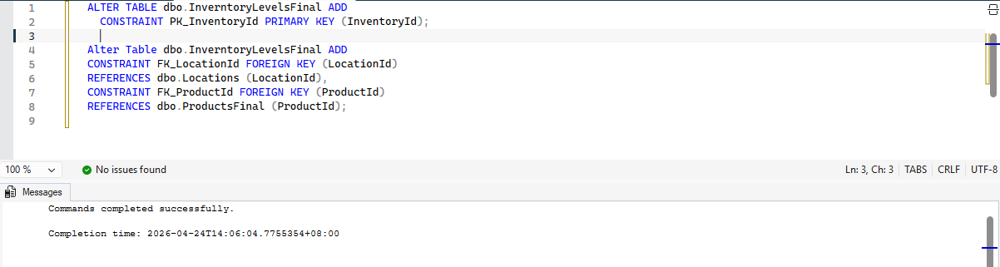

```SQL
ALTER TABLE dbo.GoodsReceivedFinal ADD 
  CONSTRAINT PK_ReceiptId PRIMARY KEY (ReceiptId);

Alter Table dbo.GoodsReceivedFinal ADD 
CONSTRAINT FK_PurchaseOrderId FOREIGN KEY (PurchaseOrderId)
REFERENCES dbo.PurchaseOrderFinal (PurchaseOrderId)
```

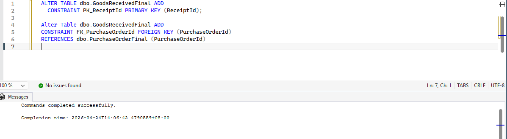

#### 5). 3.1 Populate the data warehouse database with some test data. (5 Marks)

>**Try to populate data using both the insert keyword and a data file,<br/>Check:**

**5.1) ProductsFinal table**

* **Use “insert” key word to populate:**

```SQL
INSERT INTO dbo.ProductsFinal 
(ProductId, ProductName, Brand, Category, UnitPrice) 
VALUES 
('P0001', 'Banana', 'BrandC', 'Fruit','15.32'),
('P0002', 'Banana', 'BrandC', 'Fruit','15.32')
```

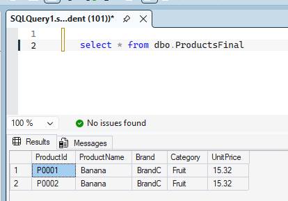

* **Import data file into SSMS:**

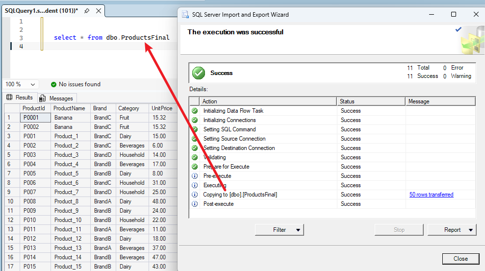

**5.2) Suppliers table**

* **Use “insert” key word to populate:**

```SQL
INSERT INTO dbo.Suppliers 
(SupplierId, SupplierName, ContactName, Phone, Email, Address) 
VALUES 
('S0001', 'Supplier_1', 'Contact_1', '65-9000-1', 
'supplier1@grabmart.com', 'Address_1, Singapore'),
('S0002', 'Supplier_2', 'Contact_2', '65-9000-2', 
'supplier2@grabmart.com', 'Address_2, Singapore') 
```

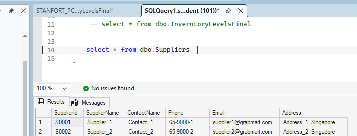

* **Import data file into SSMS:**

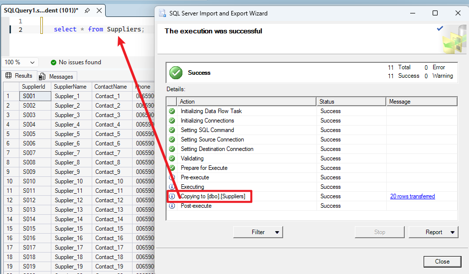

**5.3) Locations table**

* **Use “insert” key word to populate:**

```SQL
INSERT INTO dbo.Locations
(LocationId, LocationName, LocationType, City) 
VALUES 
('L0009', 'Location_9', 'Dark Store', 'Singapore'),
('L0010', 'Location_10', 'Dark Store', 'Singapore')
```

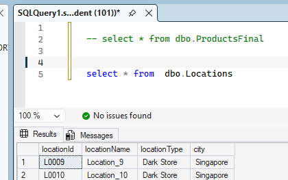

* **Import data file into SSMS:**

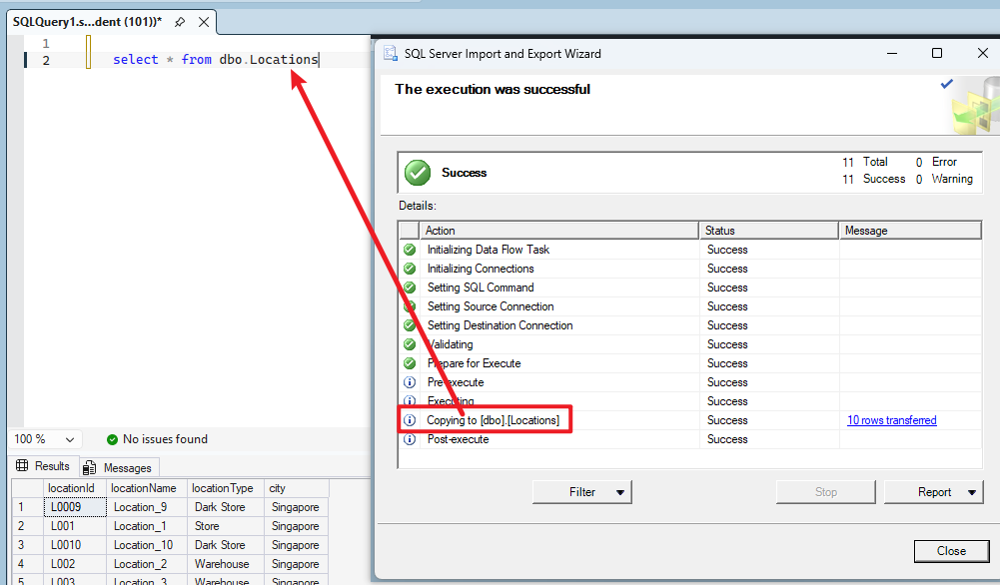

**5.4) PurchaseOrderFinal table**

* **Use “insert” key word to populate:**

```SQL
INSERT dbo.PurchaseOrderFinal 
(PurchaseOrderId, OrderDate, ProductId, SupplierId, OrderedQuantity, UnitCost) 
VALUES 
('PO00499', '2026-02-17', 'P0001', 'S0001', 272, '40.63'),
('PO00500', '2026-09-04', 'P0002', 'S0002', 190, '47.75')
```

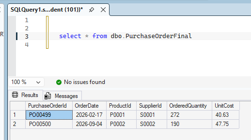

* **Import data file into SSMS:**

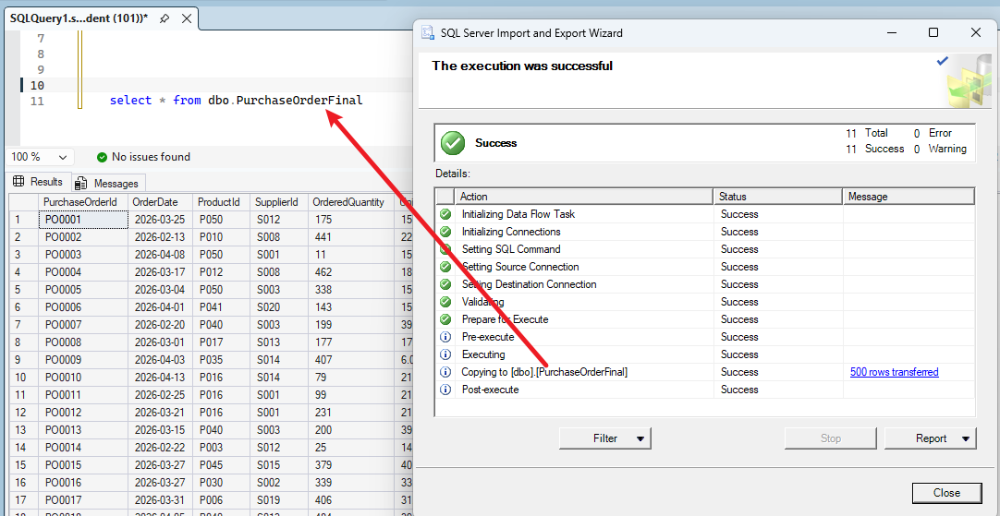

**5.5) GoodsReceived table**

* **Use “insert” key word to populate:**

```SQL
INSERT INTO dbo.GoodsReceivedFinal 
(ReceiptId, PurchaseOrderId, OrderedQuantity, ReceivedQuantity, ReceivedDate)
VALUES 
('R10001', 'PO00499', 175, 173, '2026-04-24'),
('R10002', 'PO00499', 100, 100, '2026-04-24')
```

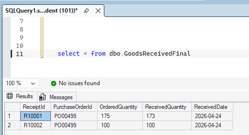

* **Import data file into SSMS:**

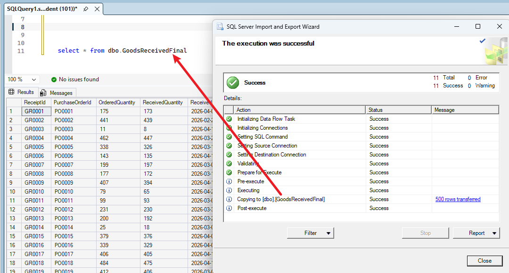

**5.6) InverntoryLevels table**

* **Use “insert” key word to populate:**

```SQL
INSERT dbo.InverntoryLevelsFinal 
(InventoryId, ProductId, LocationId, StockLevel, MinimumStockLevel, LastUpdatedDate) 
VALUES
 ('INV04981', 'P0001', 'L0009', 433, 200, '2026-04-05'),
('INV04992', 'P0002', 'L0010', 225, 200, '2026-03-23')
```

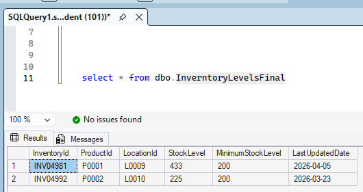

* **Import data file into SSMS:**

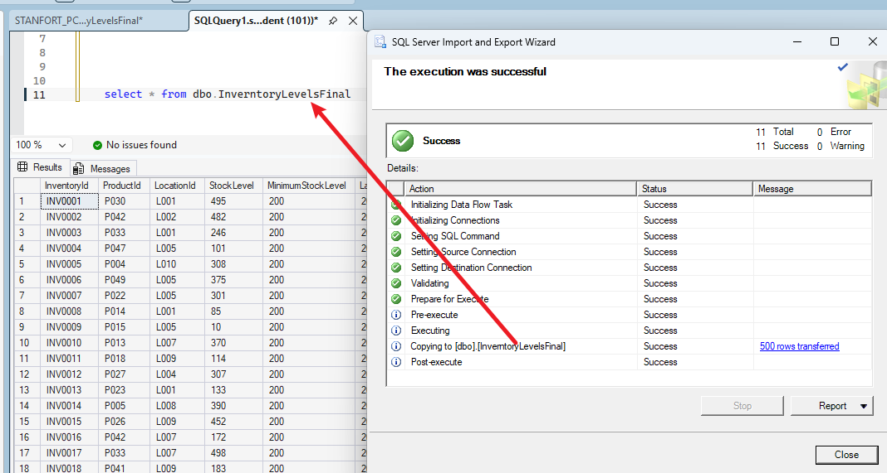

#### 6). 3.2 Export the data warehouse database data into an external data file.(5 Marks)

>In SSMS, data is exported using the SSMS tool (Tasks - Export Data).

* **Screenshot of successfully exporting GoodsReceivedFinal from the data warehouse database to a data file:**

```SQL
select * from dbo.GoodsReceivedFinal
```

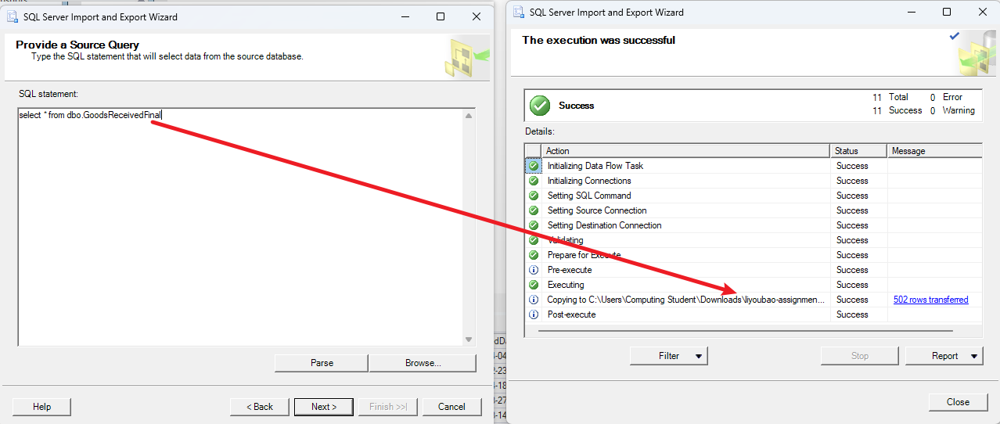

* **Screenshot of successfully exporting InverntoryLevelsFinal from the data warehouse database to a data file:**

```SQL
select * from dbo.InverntoryLevelsFinal
```


* **Screenshot of successfully exporting Locations from the data warehouse database to a data file:**

```SQL
select * from dbo.Locations
```

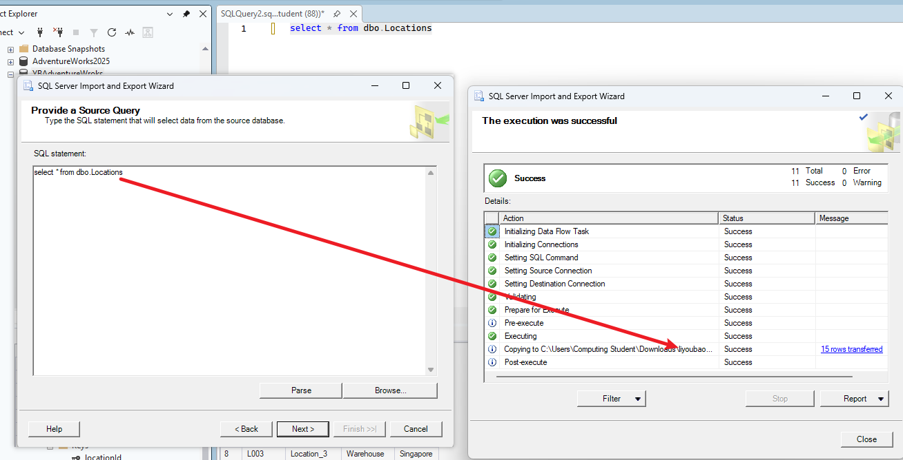

* **Screenshot of successfully exporting ProductsFinal from the data warehouse database to a data file:**

```SQL
select * from dbo.ProductsFinal
```

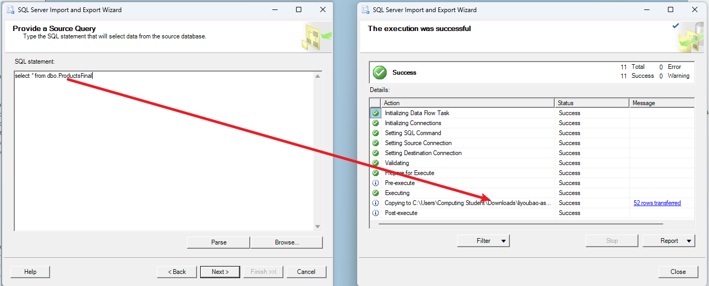

* **Screenshot of successfully exporting PurchaseOrderFinal from the data warehouse database to a data file:**

```SQL
select * from dbo.PurchaseOrderFinal
```

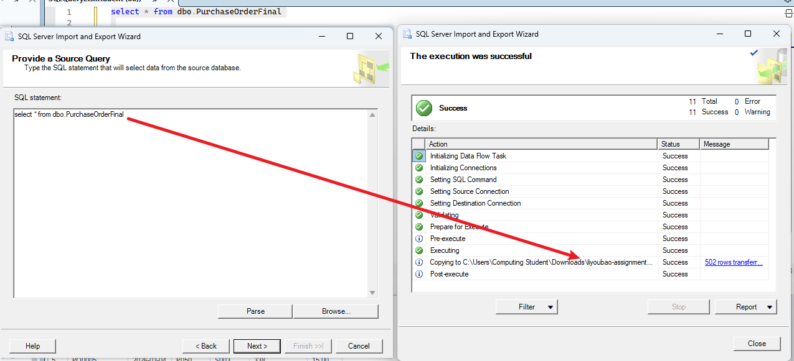

* **Screenshot of successfully exporting Suppliers from the data warehouse database to a data file:**

```SQL
select * from dbo.Suppliers
```

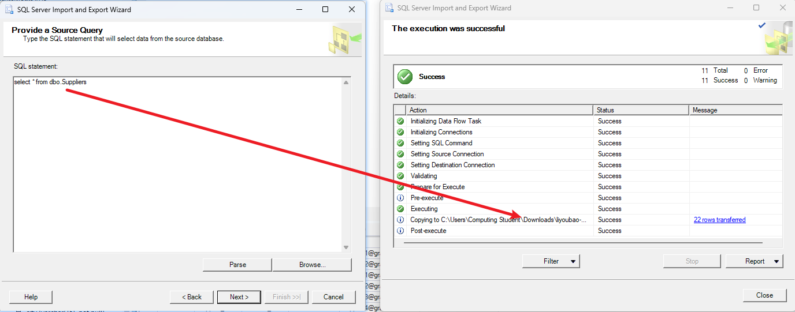

---

## 4.The implementation and testing of the BigData storage on HDFS (including the Pig commands and their results)

><font color="#968107">This section corresponds to questions 3.3, 3.4, and 3.5 in the original questions.</font>

#### 1). 3.3 Migrate the data file from the file system to Apache HDFS. (5 Marks)

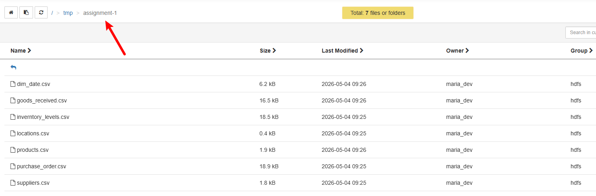

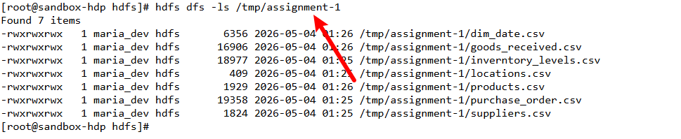

#### 2). 3.4 Create a suitable data structure for loading the data file into HIVE(5 Marks)

* **2.1) Upload the data file I need:**

><font color="#968107">I used "purchase_order.csv" to achieve this.<br>Upload this file to "/user/maria_dev/",<br>Grant read, write, and execute permissions.</font>

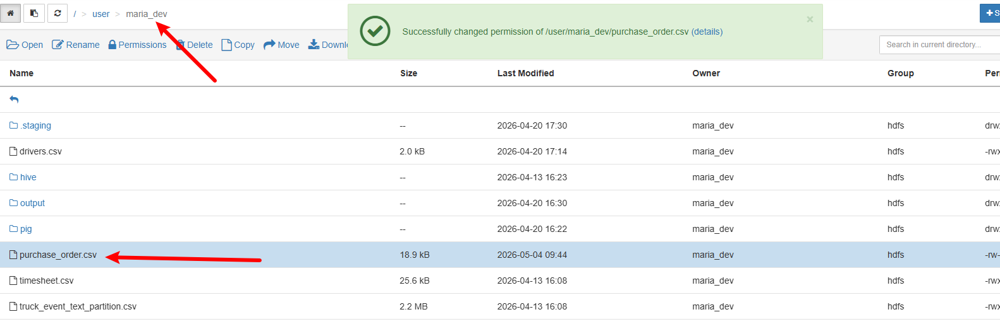

* **2.2) Create a temporary table to store the data from the purchase_order.csv file,Execute SQL Command:**

```SQL
 create table temp_purchase_order (col_value string) stored as TEXTFILE
```

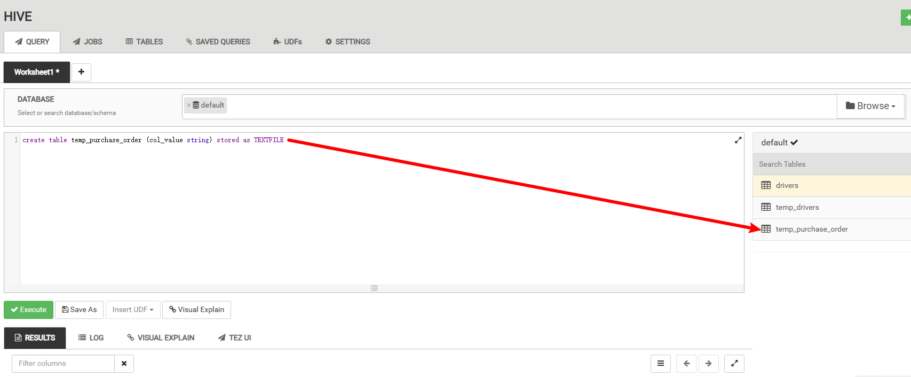

* **2.3) Load the data from the purchase_order.csv file and check,Execute SQL Command:**

```SQL
load data inpath '/user/maria_dev/purchase_order.csv' overwrite into table temp_purchase_order
select * from temp_purchase_order limit 5
```

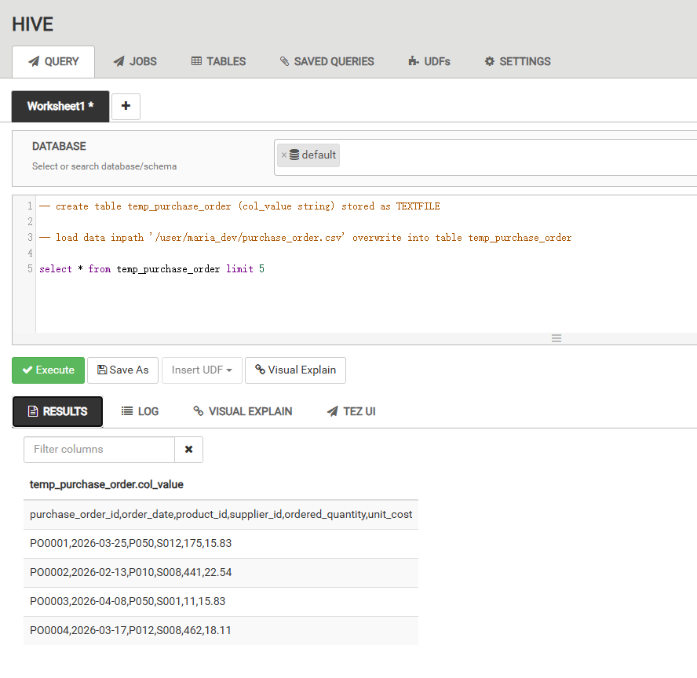

* **2.4) Create an entity table to insert the contents of the temporary table into the entity table,Execute SQL Command:**

```SQL
create table purchaseOrderFact
(
    purchaseOrderId string,
    orderDate string,
    productId string,
    supplierId string,
    orderedQuantity int,
    unitCost float
);
```

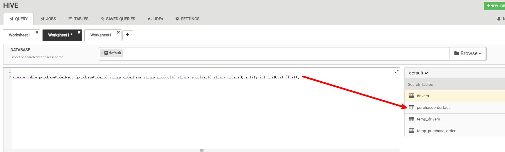

* **2.5) Insert from Temporary table and check,Execute SQL Command:**

```SQL
insert overwrite table purchaseorderfact
select 
    regexp_extract(col_value, '^(?:([^,]*),?){1}',1) purchaseOrderId,
    regexp_extract(col_value, '^(?:([^,]*),?){2}',1) orderDate,
    regexp_extract(col_value, '^(?:([^,]*),?){3}',1) productId,
    regexp_extract(col_value, '^(?:([^,]*),?){4}',1) supplierId,
    regexp_extract(col_value, '^(?:([^,]*),?){5}',1) orderedQuantity,
    regexp_extract(col_value, '^(?:([^,]*),?){6}',1) unitCost
from temp_purchase_order

select * from purchaseOrderFact
```

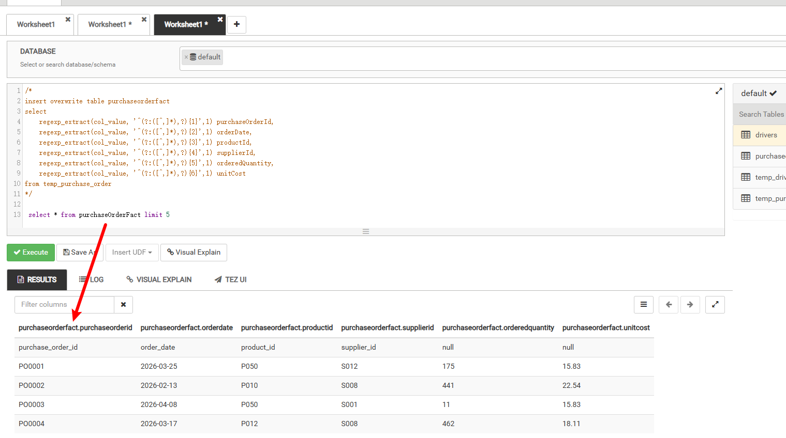

#### 3). 3.5 Demonstrate the use of Apache Pig for manipulating the loaded data (5 Marks)

* **3.1) Load and Dump data,Command:**

><font color="#968107">Upload "GoodsReceived.csv","Products.csv" and "PurchaseOrderFinal.csv" file to the "/user/maria_dev/" directory and grant it read, write, and execute permissions.</font>

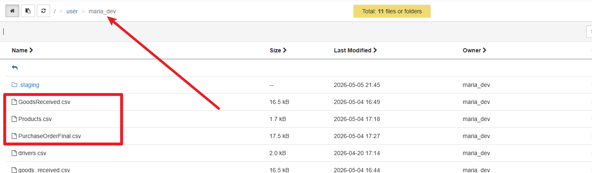

```SQL
-- load data from GoodsReceived.csv
tmp_data= LOAD '/user/maria_dev/GoodsReceived.csv' USING PigStorage(',')
AS (
ReceiptId:chararray,
PurchaseOrderId:chararray,
OrderedQuantity:int,
ReceivedQuantity:int,
ReceivedDate:chararray
);

DESCRIBE tmp_data;

-- Limit output to 5 data entries
tmp_data_subset = LIMIT tmp_data 5;
DESCRIBE tmp_data_subset;

-- dump data
DUMP tmp_data_subset;
```

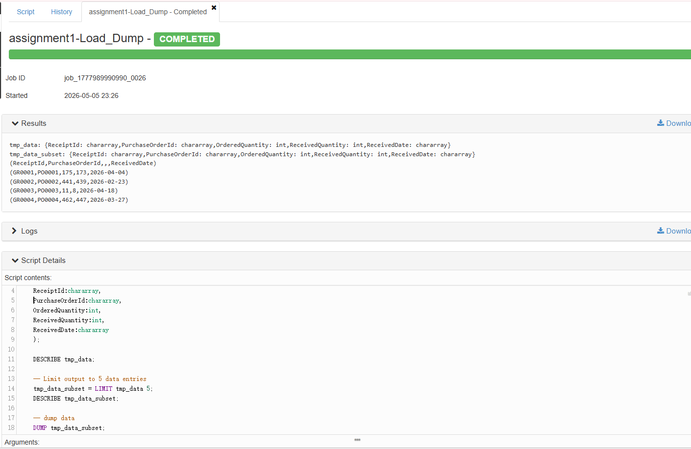


* **3.2) Store data to the specified directory,Command:**

```SQL
-- load data from GoodsReceived.csv
tmp_data= LOAD '/user/maria_dev/GoodsReceived.csv' USING PigStorage(',')
AS (
ReceiptId:chararray,
PurchaseOrderId:chararray,
OrderedQuantity:int,
ReceivedQuantity:int,
ReceivedDate:chararray
);

tmp_data_subset = LIMIT tmp_data 10;
specific_columns = FOREACH tmp_data_subset GENERATE ReceiptId, PurchaseOrderId, OrderedQuantity;
DESCRIBE specific_columns;

-- store data to INTO new file
STORE specific_columns INTO 'output/LYB_tmp_specific_columns' USING PigStorage(',');
```

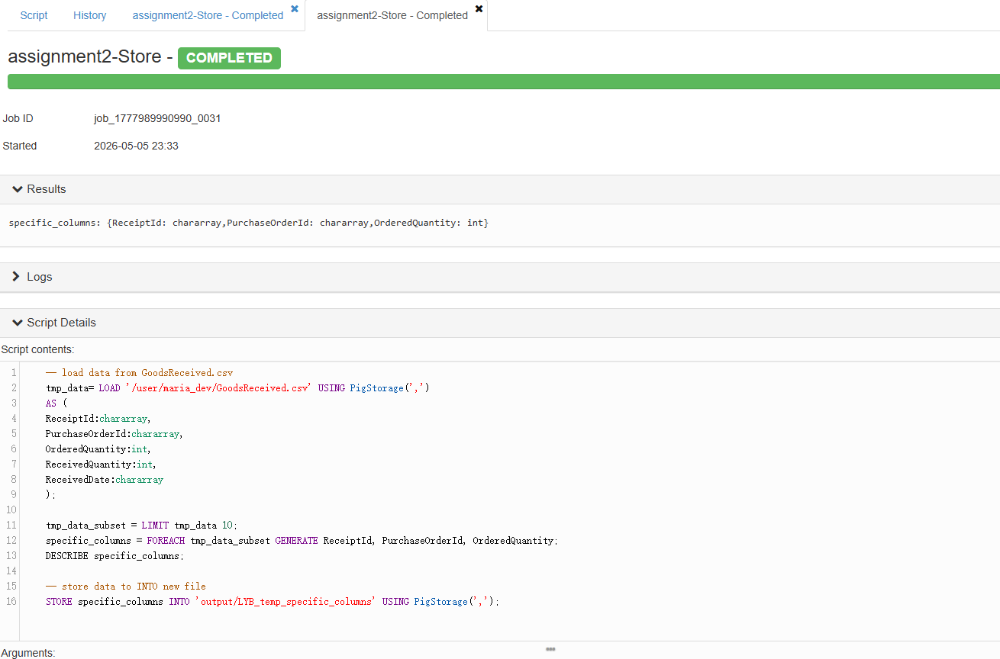

* **3.3) Execute the order by option to sort by ReceiptId in ascending order.**

```SQL
tmp_data= LOAD '/user/maria_dev/GoodsReceived.csv' USING PigStorage(',')
AS (
ReceiptId:chararray,
PurchaseOrderId:chararray,
OrderedQuantity:int,
ReceivedQuantity:int,
ReceivedDate:chararray
);

-- sort by ReceiptId in ascending order
ordered_list = ORDER tmp_data BY ReceiptId asc;
DUMP ordered_list;
```

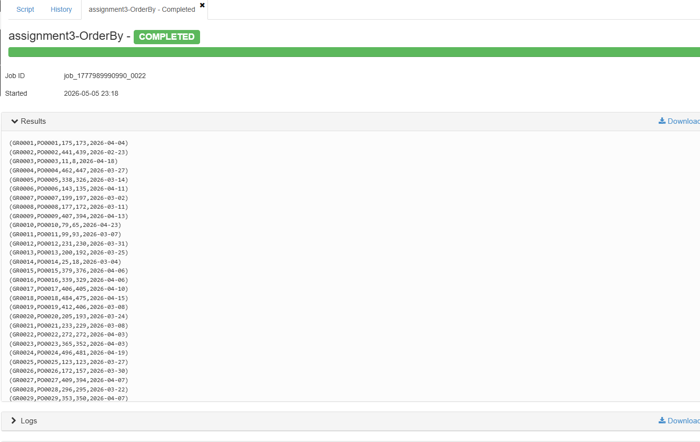

* **3.4) Match categor that are ‘Beverages’ and group them by ‘Brand’.**

```SQL
tmp_data= LOAD '/user/maria_dev/Products.csv' USING PigStorage(',')
AS (
ProductId:chararray,
ProductName:chararray,
Brand:chararray,
Category:chararray,
UnitPrice:chararray
);
-- Match 'Beverages'
filtered_events = FILTER tmp_data BY NOT (Category MATCHES 'Beverages');
-- Group by 'Brand'
grouped_events = GROUP filtered_events BY Brand;
DESCRIBE grouped_events;
DUMP grouped_events;
```

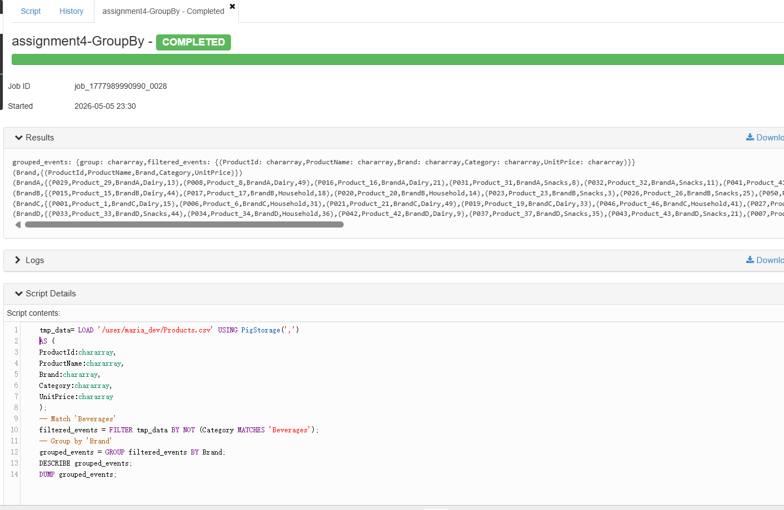

* **3.5) Join the `test_events` and `test_events_order` tables using `ProductId`.**

```SQL
-- load Products data
tmp_data= LOAD '/user/maria_dev/Products.csv' USING PigStorage(',')
AS (
ProductId:chararray,
ProductName:chararray,
Brand:chararray,
Category:chararray,
UnitPrice:chararray
);

-- load PurchaseOrderFinal data
tmp_data_order= LOAD '/user/maria_dev/PurchaseOrderFinal.csv' USING PigStorage(',')
AS (
PurchaseOrderId:chararray,
OrderDate:chararray,
ProductId:chararray,
SupplierId:chararray,
OrderedQuantity:chararray,
UnitCost:float
);

-- join tmp_data and tmp_data_order
result = JOIN tmp_data BY (ProductId), tmp_data_order BY (ProductId);
DESCRIBE result;
```

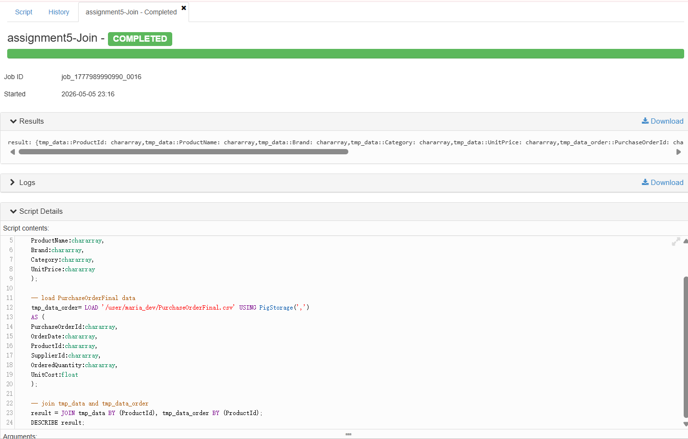

---

## 5.Provide a personal reflective conclusion of what you have learnt from your overall coursework. (3 Marks)

During this semester's studies, I mastered the core technologies of big data storage. Through in-depth practice with SQL Server and SSMS, I not only became proficient in using SQL for complex queries and architecture design, but also gained a deeper understanding of the crucial role of primary and foreign keys in data structures.

Meanwhile, learning Apache HDFS broadened my technical horizons. By building and maintaining a distributed file system, I mastered data block management methods and understood how to overcome bottlenecks in big data scenarios.

This learning experience made me realize that both pursuing the ultimate relational database and emphasizing high-performance storage structures are powerful tools for solving different business scenarios. In future practice, I will try to combine the two to explore how to build a more efficient and stable hybrid data architecture in large-scale concurrent environments.

Meanwhile, through extracurricular learning, I also learned about the advantages and disadvantages of Apache HDFS and SSMS data warehouses.

In the fields of big data processing and traditional business intelligence (BI), Apache HDFS and SQL Server (SSMS)-based data warehouses represent two distinct architectures. The following is a summary of their advantages and disadvantages:

First, Apache HDFS: The Cornerstone of Distributed Storage

Advantages:

* **Extremely High Scalability:**
  HDFS uses a distributed architecture, enabling easy scaling to petabytes (PB) or even exabytes (EB) of data by adding inexpensive general-purpose servers <sup>[1][2]</sup>.

* **High Fault Tolerance:**
  Through a multi-replica mechanism, HDFS can automatically handle node failures, ensuring data availability even in the event of hardware damage <sup>[1][3]</sup>.

* **Support for Unstructured Data:**
  It does not require a predefined schema (Schema-on-Read) and can store data in various raw formats such as videos, logs, and images, making it an ideal choice for building "data lakes" <sup>[2][4]</sup>.

Disadvantages:

* **High Latency:**
  It is designed for high throughput, not low-latency access, and is not suitable for real-time point queries <sup>[1][3]</sup>.

* **Operational Complexity:**
  Lacking native robust indexing and ACID transaction support, it typically requires integration with components like Hive and Spark for data analysis <sup>[4][5]</sup>.

Secondly, SSMS (SQL Server) Data Warehouse: The Essence of Relational Architecture

Advantages:

* **High-Performance Queries:**
  Possesses a mature query optimizer, indexing mechanism, and columnstore indexes, performing exceptionally well in complex multi-table joins and report generation <sup>[6][7]</sup>.

* **Strict Security and Transactions:**
  Provides robust access control and ACID transaction guarantees, ensuring data accuracy and the rigor of business logic <sup>[6][8]</sup>.

* **Ease of Use and Ecosystem:**
  SSMS offers an intuitive graphical interface, and SQL is widely used, allowing seamless integration with analytics tools like Power BI <sup>[7][9]</sup>.

Disadvantages:

* **High Scaling Costs:**
  While SQL Server supports distributed architectures (such as PolyBase), its vertical scaling costs are significantly higher compared to HDFS horizontal scaling <sup>[6][10]</sup>.

* **Rigid Schema:**
  Strict schema-on-write design reduces flexibility when handling semi-structured or unstructured data <sup>[8][10]</sup>.

Apache HDFS is suitable as a data infrastructure for handling massive, diverse, and rapidly growing raw data; while SQL Server data warehouses are better suited for storing cleaned, highly structured core business data requiring frequent interactive analysis.

In modern enterprise architectures, the two are often complementary rather than mutually exclusive. A common best practice is to use HDFS to store massive amounts of raw data and then import high-value aggregated data into SQL Server via ETL processes, achieving a balance between cost, scalability, and analytical efficiency <sup>[4][9][10]</sup>.

## References

[1] Apache Software Foundation. *Hadoop Distributed File System (HDFS) Architecture Guide*. Updated 2023. 
[2] Apache Software Foundation. *Apache Hadoop Documentation*. 2022–2024.
[3] Shvachko, K. et al. *The Hadoop Distributed File System*. IEEE (updated references and interpretations in recent Hadoop docs, 2021–2023 editions).
[4] Databricks. *Data Lakehouse & HDFS Best Practices*. 2022–2024.
[5] Apache Spark Documentation. 2023–2025.
[6] Microsoft. *SQL Server 2022 Documentation*. 2022–2025.
[7] Microsoft Learn. *SQL Server Query Processing and Performance Tuning*. Updated 2023–2025.
[8] Microsoft Learn. *Transactions and ACID Properties in SQL Server*. 2022–2024.
[9] Power BI Documentation. 2023–2025.
[10] Microsoft Learn. *Data Warehousing, PolyBase, and Scaling Strategies*. 2022–2025.
